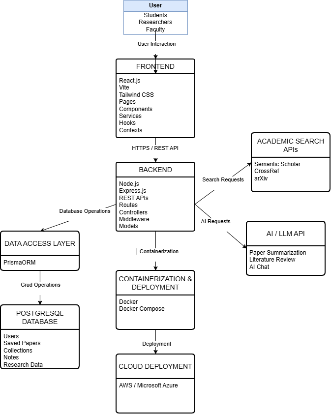
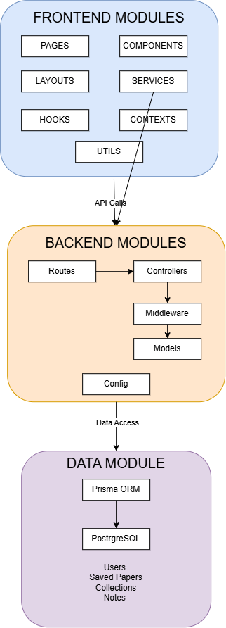
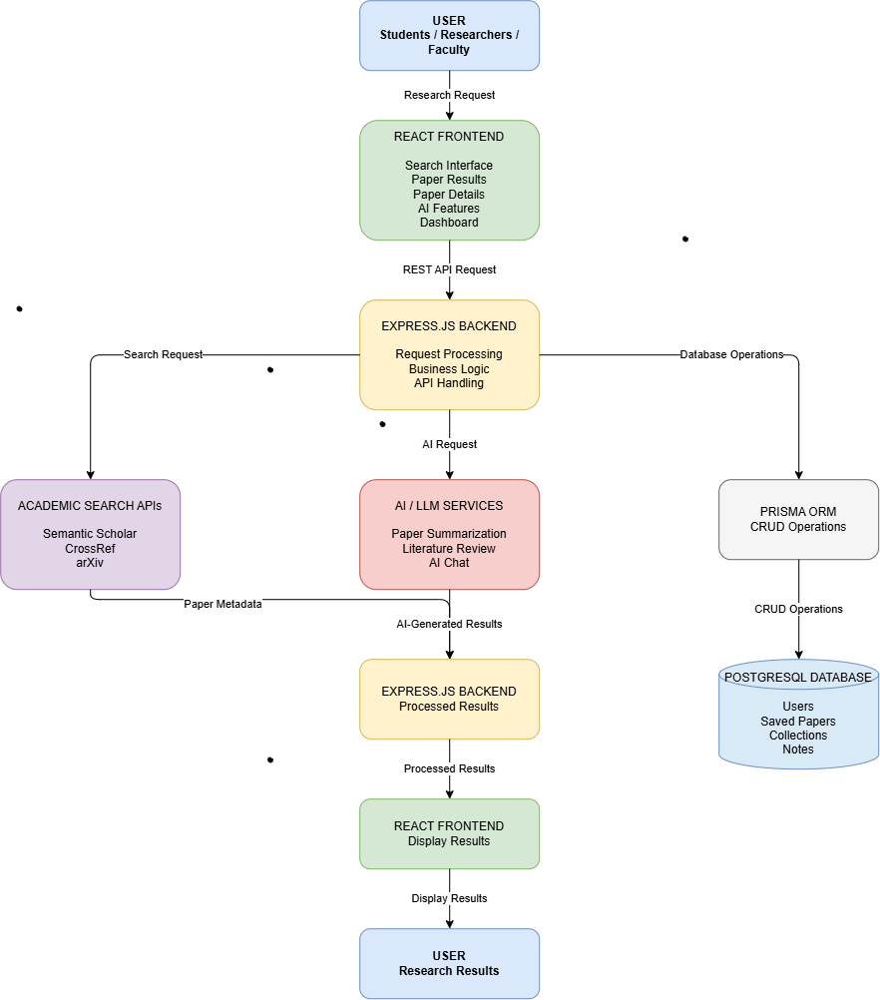

# 📚 ResearchPilot

> An AI-powered research assistant that helps students and researchers discover scholarly papers, generate AI summaries, organize references, and automatically draft literature reviews.

---

# 🚀 Project Overview

ResearchPilot is a web application designed to simplify the academic research process by combining scholarly paper search with Artificial Intelligence. Instead of manually searching through hundreds of papers and spending hours writing literature reviews, users can search for research articles, receive concise AI-generated summaries, organize relevant papers, and generate structured literature reviews.

The project aims to reduce the time required for literature review preparation while improving the quality and accessibility of academic research.

---

# ❗ Problem Statement

Researchers and students often spend significant amounts of time:

- Searching multiple research databases
- Reading lengthy research papers
- Identifying relevant studies
- Comparing different research findings
- Writing literature reviews manually
- Managing references

These repetitive tasks consume valuable research time and can slow down academic productivity.

ResearchPilot addresses these challenges by integrating AI-powered summarization and literature review generation into a single platform.

---

# 🎯 Vision Statement

To build an intelligent research companion that enables researchers and students to conduct literature reviews faster, organize academic resources efficiently, and accelerate the research process through Artificial Intelligence.

---

# 🎨 Software Design

ResearchPilot uses a modular design approach that separates user interface components, backend responsibilities, data access, external scholarly services, and AI services. This separation improves maintainability, reduces coupling between modules, and allows individual components to be modified or extended without significantly affecting the rest of the system.

## Design Artifacts

The editable Draw.io diagrams and exported images are available in the `/design/` directory.

### Architecture Diagram



### Component Diagram



### Data Flow Diagram



## UI Design

The ResearchPilot interface was designed using Figma and includes six primary screens:

1. Landing Page
2. Login
3. Dashboard
4. Search Results
5. Paper Details
6. Literature Review Generator

The Figma prototype link is available in:

`design/Figma_Link.txt`

--

# 👥 Target Users

## Undergraduate Students

**Goals**

- Learn research methodology
- Find academic papers quickly
- Understand complex papers
- Write literature reviews

**Pain Points**

- Limited research experience
- Difficulty understanding technical papers
- Time-consuming manual searching

---

## Master's Students

**Goals**

- Conduct literature surveys
- Organize research references
- Compare previous work

**Pain Points**

- Large volume of papers
- Difficulty managing citations
- Manual literature review writing

---

## PhD Researchers

**Goals**

- Stay updated with latest research
- Analyze multiple publications
- Produce high-quality literature reviews

**Pain Points**

- Information overload
- Repetitive summarization
- Time-intensive literature analysis

---

# ✨ Key Features

## Must Have

- User Authentication
- Research Paper Search
- AI Paper Summarization
- Literature Review Generation
- Save Papers
- Responsive User Interface

## Should Have

- Paper Comparison
- Keyword Highlighting
- Citation Export
- Search Filters

## Could Have

- Dark Mode
- PDF Upload
- Reading Progress
- AI Chat Assistant

## Won't Have (Version 1)

- Mobile Application
- Offline Mode
- Collaborative Editing
- Multi-language Support

---

# 📈 Success Metrics

The project will be considered successful if it can:

- Reduce literature review preparation time by at least 50%
- Generate meaningful AI summaries
- Successfully retrieve scholarly papers
- Provide a clean and responsive user interface
- Maintain stable backend API performance

---

# ⚠️ Assumptions

- Users have internet connectivity.
- External scholarly APIs remain available.
- AI services are accessible during request processing.
- Users possess basic knowledge of academic research.

---

# 🚧 Constraints

- Limited free API requests
- AI response latency
- Internet dependency
- Initial release focuses on web platform only

---

# 💻 Technology Stack

## Frontend

- React
- Vite
- Tailwind CSS

## Backend

- Node.js
- Express.js

## Database

- PostgreSQL
<<<<<<< HEAD
<<<<<<< HEAD
- Docker
=======
- Prisma ORM
>>>>>>> 042ec65 (Review 2: Design folder added, ReadME Updated)

## External Services

- Semantic Scholar API
- CrossRef API
- arXiv API
- AI / LLM Services

## Development Tools

<<<<<<< HEAD
Current feature branches:
- feature/readme
- feature/frontend
- feature/backend
- feature/docker
=======
- Prisma ORM

## Development Tools

=======
>>>>>>> 042ec65 (Review 2: Design folder added, ReadME Updated)
- Docker Desktop
- Git
- GitHub
- VS Code
<<<<<<< HEAD
=======
- npm
>>>>>>> 042ec65 (Review 2: Design folder added, ReadME Updated)

---

# 🏗 System Architecture

<<<<<<< HEAD
```text
                User

                  │

                  ▼

      React + Tailwind Frontend

                  │

             REST API Calls

                  │

                  ▼

         Express.js Backend

                  │

        Prisma ORM Layer

                  │

                  ▼

          PostgreSQL Database

                  │

                  ▼

      Google Scholar API (Future)

                  │

                  ▼

          AI Model / LLM API
```
=======
ResearchPilot follows a modular web application architecture consisting of a React frontend, Express.js backend, Prisma ORM, PostgreSQL database, external scholarly APIs, and AI services.


---

# 🧩 Component / Module Architecture

The application is organized into separate frontend and backend modules to improve maintainability and separation of responsibilities.


---

# 🔄 Data Flow

The data flow describes how research requests move through the frontend, backend, external services, AI services, and database.


>>>>>>> 042ec65 (Review 2: Design folder added, ReadME Updated)

---

# 📂 Project Structure

```text
ResearchPilot/

├── frontend/
│   ├── src/
<<<<<<< HEAD
=======
│   │   ├── assets/
│   │   ├── components/
│   │   ├── contexts/
│   │   ├── hooks/
│   │   ├── layouts/
│   │   ├── pages/
│   │   ├── services/
│   │   ├── types/
│   │   ├── utils/
│   │   ├── App.jsx
│   │   └── main.jsx
>>>>>>> 042ec65 (Review 2: Design folder added, ReadME Updated)
│   ├── public/
│   ├── package.json
│   └── vite.config.js
│
├── backend/
│   ├── src/
<<<<<<< HEAD
│   ├── prisma/
=======
│   │   ├── config/
│   │   ├── controllers/
│   │   ├── middleware/
│   │   ├── models/
│   │   └── routes/
>>>>>>> 042ec65 (Review 2: Design folder added, ReadME Updated)
│   ├── package.json
│   ├── Dockerfile
│   └── .env
│
<<<<<<< HEAD
├── docker-compose.yml
└── README.md
```

---

# 🌿 Branching Strategy

This project follows the **GitHub Flow** workflow.

### Main Branch

- `main`
  - Stable production-ready code

### Feature Branches

- `feature/frontend`
- `feature/backend`
- `feature/docker`
- `feature/readme`

Development is performed in feature branches and later merged into the `main` branch after testing.

---

# 🐳 Docker Support

The project uses Docker to simplify development and deployment.

Containers include:

- Frontend
- Backend
- PostgreSQL Database

Docker Compose is used to orchestrate all services.

---

# ⚡ Quick Start – Local Development

## Clone Repository

```bash
git clone https://github.com/yourusername/ResearchPilot.git

cd ResearchPilot
```

---

## Backend Setup

```bash
cd backend

npm install

npm run dev
```

Backend runs on:

```
http://localhost:5000
```

---

## Frontend Setup

```bash
cd frontend

npm install

npm run dev
```

Frontend runs on:

```
http://localhost:5173
```

---

## Docker Setup

Run the complete application using Docker:

```bash
docker compose up --build
```

---

# 🗄 Database

Database: PostgreSQL

ORM: Prisma

Example schema:

- User
- SavedPaper

Future versions will include:

- Literature Reviews
- Search History
- Notes
- References

---

# 📖 Local Development Tools

The following software was used during development:

- Visual Studio Code
- Git
- GitHub
- Docker Desktop
- PostgreSQL
- Prisma ORM
- Node.js
- npm

---

# 📅 Development Timeline

## Phase 1

- Project Planning
- Vision Document
- User Stories
- Wireframes

## Phase 2

- Frontend Development
- Backend Development
- Database Setup

## Phase 3

- Docker Integration
- Testing
- Documentation

---

# 🔮 Future Enhancements

- Google Scholar Integration
- Semantic Scholar API
- AI-powered citation generation
- PDF annotation
- Research recommendation engine
- Collaborative workspaces
- Citation manager
- Export to BibTeX
- Export to IEEE/APA/MLA
- AI chatbot for paper explanation

---

# 👨‍💻 Developers

Developed as part of the Digital Assignment for Software Engineering.

Project Name:

**ResearchPilot**

---

# 📄 License

This project is intended for educational purposes only.
>>>>>>> dd79661 (Updated readme file)
=======
├── design/
│   ├── ResearchPilot_Architecture.drawio
│   ├── ResearchPilot_Architecture.png
│   ├── ResearchPilot_Component_Diagram.drawio
│   ├── ResearchPilot_Component_Diagram.png
│   ├── ResearchPilot_Data_Flow.drawio
│   ├── ResearchPilot_Data_Flow.png
│   ├── Figma_Link.txt
│   └── figma/
│
├── docker-compose.yml
└── README.md
>>>>>>> 042ec65 (Review 2: Design folder added, ReadME Updated)
